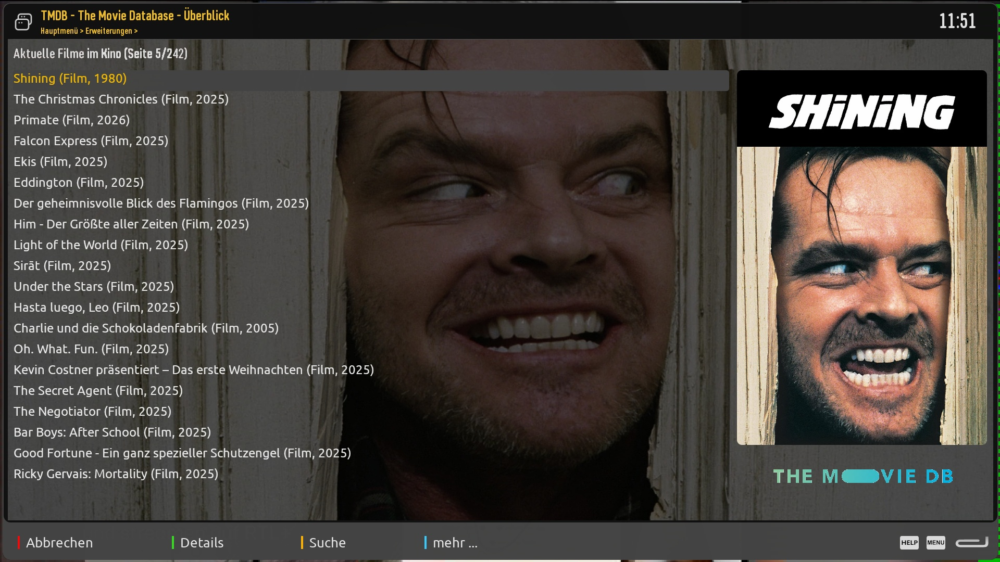
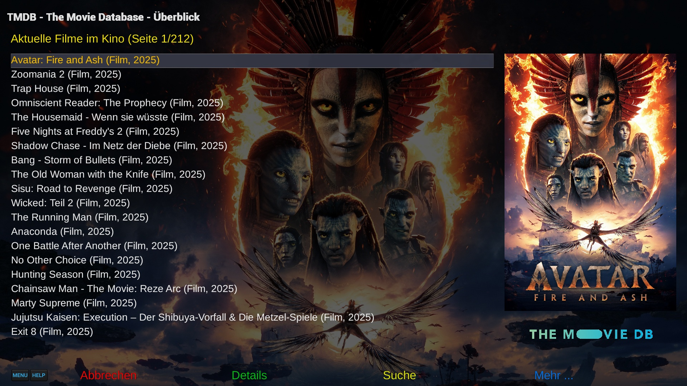

# The Movie Database plugin TMDBCockpit
Browse/query TMDB Database for movie info

## E2-DarkOS skin

## All other skins

## Features
- Shows detailed movie/tv show information provided by TMDB.
- Can be invoked thru movie lists (standard, EMC, etc.) or thru red key in EPG lists.
- Provides an interface for other plugins to access TMDB data without opening TMDBCockpit screens.
- Allows to save movie as well as series episode covers, descriptions and backdrops.
- Allows unique tmdb api key in /etc/enigma2/tmdb_key.txt
- Allows playback of YouTube trailers.

## Limitations
- Supports Enigma2 on OpenViX and compatible distributions only
- Is being tested on DM9xx only

## Links
- Installation: https://xcentaurix.github.io/TMDBCockpit
